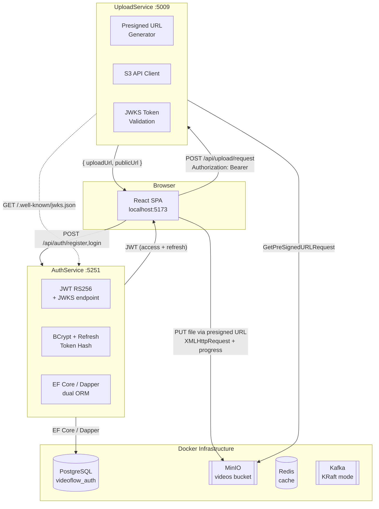

# VideoFlow — Architecture Diagrams

## 1. Current Architecture (implemented)

## 2. Planned Architecture (full target)

```mermaid
flowchart TB
    subgraph Browser["Browser"]
        REACT[React SPA<br/>+ HLS.js player]
    end

    subgraph Gateway["API Gateway (planned)"]
        YARP[YARP Reverse Proxy<br/>Routing + Rate Limit + Auth]
    end

    subgraph Services["Microservices"]
        AUTH[AuthService<br/>JWT + JWKS + BCrypt]
        UPLOAD[UploadService<br/>Presigned S3 URLs]
        VIDEO[VideoService<br/>planned<br/>gRPC + Metadata CRUD]
        PROCESS[ProcessingService<br/>planned<br/>FFmpeg → HLS]
    end

    subgraph Bus["Event Bus"]
        KAFKA_TOPIC(((Kafka<br/>video.uploaded<br/>video.processed)))
    end

    subgraph Storage["Data Layer"]
        PG_AUTH[(PostgreSQL<br/>videoflow_auth)]
        PG_VID[(PostgreSQL<br/>videoflow_videos)]
        MINIO_VID[[MinIO<br/>videos bucket]]
        MINIO_HLS[[MinIO<br/>hls bucket]]
        REDIS_CACHE[(Redis)]
    end

    %% Flows
    REACT -->|"all /api/*"| YARP

    YARP --> AUTH
    YARP --> UPLOAD
    YARP -.-> VIDEO
    YARP -.-> PROCESS

    AUTH --> PG_AUTH
    UPLOAD --> MINIO_VID
    VIDEO -.-> PG_VID

    UPLOAD -.->|publish: video.uploaded| KAFKA_TOPIC
    VIDEO -.->|publish: video.metadata| KAFKA_TOPIC
    KAFKA_TOPIC -.->|consume: process video| PROCESS

    PROCESS -.->|"write HLS .m3u8 + .ts"| MINIO_HLS

    REACT -.->|"HLS video stream"| MINIO_HLS

    UPLOAD --> REDIS_CACHE

    %% Legend
    classDef done fill:#1a3a2a,stroke:#34d399,stroke-width:2
    classDef planned fill:#2a1a0a,stroke:#fb923c,stroke-width:2,stroke-dasharray: 5 5
    classDef infra fill:#1a1a2a,stroke:#a78bfa,stroke-width:1
    classDef bus fill:#2a1a0a,stroke:#fb923c,stroke-width:1

    class AUTH,UPLOAD done
    class VIDEO,PROCESS,YARP planned
    class PG_AUTH,PG_VID,MINIO_VID,MINIO_HLS,REDIS_CACHE infra
    class KAFKA_TOPIC bus
```

**Как открыть Mermaid:**
- GitHub — отображает автоматически
- VS Code — плагин "Mermaid Preview" или Ctrl+K → V
- [mermaid.live](https://mermaid.live) — вставить и смотреть

---

**Файлы:**

| Файл | Формат | Как открыть |
|------|--------|-------------|
| `docs/architecture-current.html` | SVG/HTML | браузер |
| `docs/architecture-planned.html` | SVG/HTML | браузер |
| `docs/architecture.mermaid.md` (этот) | Mermaid | GitHub / VS Code / mermaid.live |